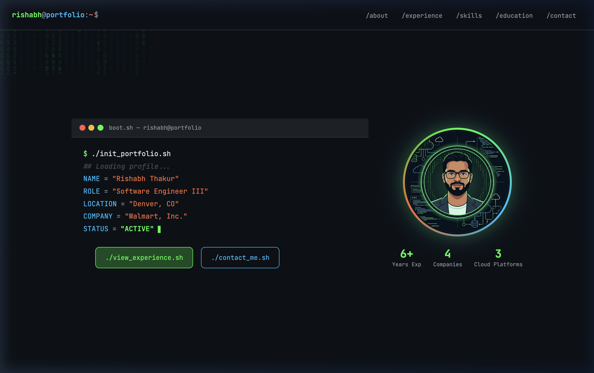
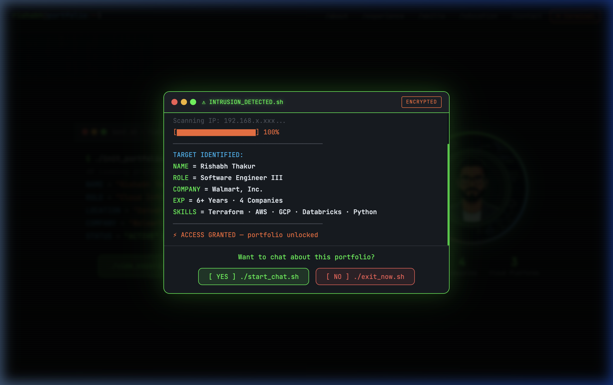
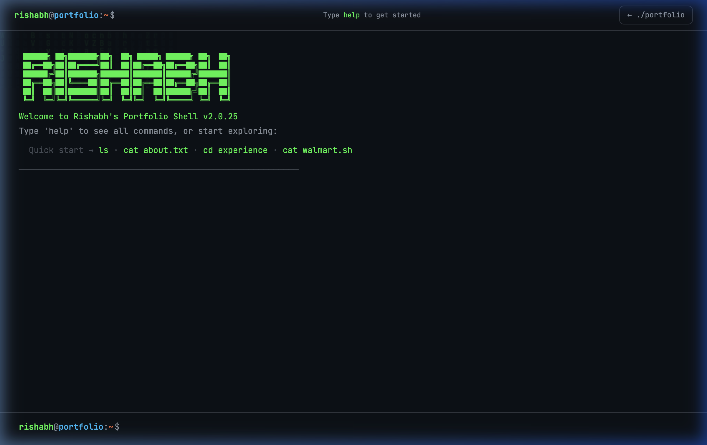

# Rishabh Thakur — Terminal Portfolio

A Linux terminal / cloud-infrastructure themed personal portfolio built with **vanilla HTML, CSS, and JavaScript** — no frameworks, no build step.

🌐 **Live site:** [thakur-rishabh.github.io/terminal-portfolio](https://thakur-rishabh.github.io/terminal-portfolio/)

---

## Screenshots

| Hero | Hacker Chat | Interactive Terminal |
|------|-------------|----------------------|
|  |  |  |

---

## Tech Stack

| Layer | Tech |
|-------|------|
| Structure | HTML5 |
| Styling | Vanilla CSS (variables, grid, flexbox, animations) |
| Logic | Vanilla JavaScript (no npm, no bundler) |
| Fonts | JetBrains Mono + Inter via Google Fonts |
| Deploy | GitHub Actions → GitHub Pages |

---

## Run Locally

```bash
# Clone the repo
git clone https://github.com/thakur-rishabh/terminal-portfolio.git
cd terminal-portfolio

# Serve with any static file server — no build needed
python3 -m http.server 8080
```

Open [http://localhost:8080](http://localhost:8080) in your browser.

---

## Deploy to GitHub Pages

Every push to `main` automatically deploys via GitHub Actions.

```bash
git add -A
git commit -m "your message"
git push
```

The workflow (`.github/workflows/deploy.yml`) handles the rest. Deployment takes ~30 seconds.

---

## Features

- **Matrix rain** background animation on the hero section
- **Boot sequence** typewriter on page load
- **Hacker intrusion popup** — slides up from bottom-right, scans your profile, offers a portfolio chatbot
- **Portfolio chatbot** — keyword-based Q&A about experience, skills, education, and contact
- **Interactive terminal page** (`terminal.html`) — real Linux commands (`ls`, `cd`, `cat`, `whoami`, `help`, etc.) that navigate portfolio content
- **Backtick shortcut** `` ` `` — press anywhere to jump to the terminal page
- Fully **responsive** and deploys as static files (no server needed)

---

## Project Structure

```
portfolio/
├── index.html          # Main portfolio page
├── terminal.html       # Interactive Linux terminal page
├── style.css           # All styles
├── script.js           # All interactivity
├── assets/
│   └── avatar.png      # Profile image
└── .github/
    └── workflows/
        └── deploy.yml  # GitHub Actions deploy workflow
```

---

## Customize

- **Personal info** — edit `index.html` (name, role, company, experience, skills, contact)
- **Terminal content** — edit the `FS` filesystem object in `terminal.html`
- **Chatbot responses** — edit the `RESPONSES` array in `script.js`
- **Colors** — edit CSS variables at the top of `style.css`
